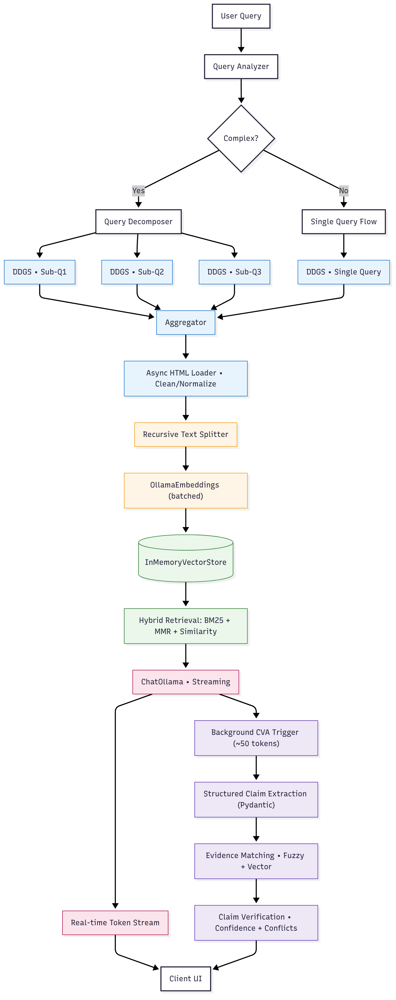

# PerFlexity

AI-powered search with real-time claim verification. Built with LangChain + Ollama for zero-cost local inference.

## ⚡ Quick Start

### One-Command Setup

```bash
git clone https://github.com/raghavdixit99/PerFlexity.git
cd per-flex-ity
./setup.sh  # Automated setup - installs everything!
```

**What the setup script does:**
- ✅ Installs Ollama (if needed)
- ✅ Downloads required AI models (~3GB total)
- ✅ Sets up Python virtual environment
- ✅ Installs all dependencies
- ✅ Creates configuration files

### Manual Setup (if needed)

**Prerequisites**: Python 3.11+, Node.js 18+

```bash
# 1. Install and start Ollama
curl -fsSL https://ollama.ai/install.sh | sh
ollama serve &

# 2. Download models
ollama pull qwen2.5:3b-instruct-q4_0    # Main chat model (~1.7GB)
ollama pull qwen2.5:1.5b-instruct       # CVA model (~1.0GB)
ollama pull nomic-embed-text             # Embeddings (~274MB)

# 3. Setup backend
cd backend
pip install -r requirements.txt
python main.py  # Runs on http://localhost:8000

# 4. Setup frontend (separate terminal)
cd frontend
npm install
npm run dev  # Runs on http://localhost:3000
```

## Testing Commands

### Quick Tests
```bash
# Health check
curl http://localhost:8000/health

# Basic query
curl -X POST "http://localhost:8000/api/ask" \
  -H "Content-Type: application/json" \
  -d '{"message": "What is GGML?", "enable_cva": true, "stream": false}'

# Complex query with decomposition
curl -X POST "http://localhost:8000/api/ask" \
  -H "Content-Type: application/json" \
  -d '{"message": "What is machine learning and how does it relate to GGML?", "enable_cva": true, "stream": true}'

# Unit tests
cd backend && python -m pytest tests/ -v
```

### Expected Results
- **Health**: `{"status":"healthy","services":{"overall":true}}`
- **Response**: JSON with response, sources, and claims  
- **Streaming**: Server-sent events with real-time tokens
- **Tests**: All unit tests should pass ✅

### System Validation

After setup, verify everything works:

```bash
# 1. Check all services healthy
curl http://localhost:8000/health
# Should return: {"status":"healthy","services":{"overall":true}}

# 2. Test basic functionality
curl -X POST "http://localhost:8000/api/ask" \
  -H "Content-Type: application/json" \
  -d '{"message": "What is GGML?", "enable_cva": true, "stream": false}'
# Should return: JSON with GGML explanation + sources + claims

# 3. Run unit tests
cd backend && python -m pytest tests/ -v
# Should show: 5 passed

# 4. Test web interface
open http://localhost:3000
# Should load: React chat interface
```

## Key Features

### **Advanced Query Processing**
- **Query Decomposition**: Complex queries automatically split into targeted sub-questions
- **Parallel Search**: Multiple searches executed concurrently for comprehensive coverage
- **LangChain DDGS**: Native DuckDuckGo search integration with async support

### **Intelligent Claim Verification**
- **Structured CVA**: Pydantic-validated claim extraction with evidence mapping
- **Atomic Claims**: Each statement verified independently with confidence scores
- **Real-time Processing**: Background verification during response streaming

### **Production Architecture**
- **LangChain Pipeline**: Battle-tested components eliminate edge cases and hanging
- **Zero-Cost Stack**: Complete local inference with Ollama (no API keys)
- **Conversation Context**: Multi-turn chat with proper context propagation

## Architecture



## Configuration

All configuration via environment variables:

```bash
# .env file
OLLAMA_BASE_URL=http://localhost:11434
LLM_MODEL=qwen2.5:3b-instruct-q4_0
CVA_CLAIM_MODEL=qwen2.5:1.5b-instruct
EMBEDDING_MODEL=nomic-embed-text
```

## API Usage

### **Basic Query**
```bash
curl -X POST "http://localhost:8000/api/ask" \
  -H "Content-Type: application/json" \
  -d '{"message": "What is machine learning?", "enable_cva": true, "stream": false}'
```

### **Streaming Response**
```bash
curl -X POST "http://localhost:8000/api/ask" \
  -H "Content-Type: application/json" \
  -d '{"message": "What is GGML?", "enable_cva": true, "stream": true}'
```

### **Follow-up Questions**
```bash
curl -X POST "http://localhost:8000/api/ask" \
  -H "Content-Type: application/json" \
  -d '{"message": "explain that in detail", "conversation_id": "your-conversation-id", "enable_cva": false, "stream": false}'
```
### **Conversations API**
```bash
# List all conversations
curl -X GET "http://localhost:8000/api/conversations"

# Search conversations by content
curl -X GET "http://localhost:8000/api/conversations/search?q=GGML"

# Get specific conversation with messages
curl -X GET "http://localhost:8000/api/conversations/{conversation_id}"

# Delete conversation
curl -X DELETE "http://localhost:8000/api/conversations/{conversation_id}"
```

**Response Format:**
```json
{
  "conversations": [
    {
      "id": "conversation-uuid",
      "title": "What is GGML?", 
      "created_at": "2025-08-30T22:00:00Z",
      "updated_at": "2025-08-30T22:05:00Z",
      "message_count": 4
    }
  ],
  "total": 1,
  "page": 1,
  "limit": 50
}
```

Built with LangChain for production reliability and Ollama for zero-cost local inference.

## 📄 License

MIT License - Build amazing AI search systems!
